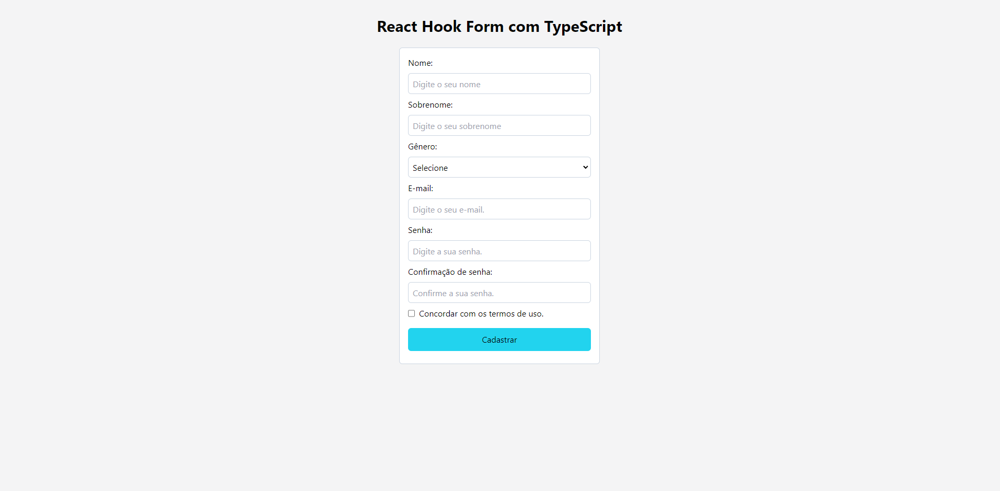
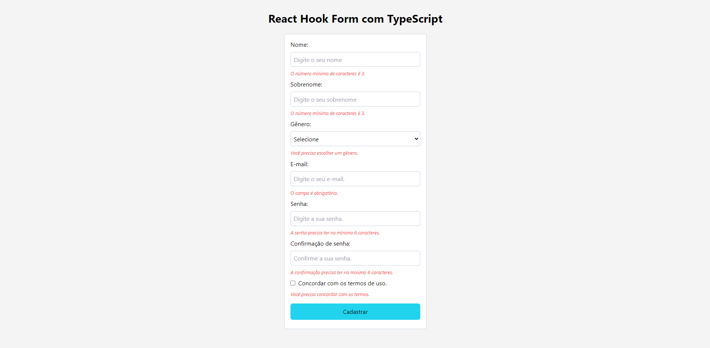

# Projeto React Hook Form com TypeScript

## Descrição

O projeto React Hook Form com TypeScript é uma aplicação de exemplo que demonstra a implementação de um formulário de cadastro de usuário utilizando tecnologias como React, TypeScript, React Hook Form e Zod. O objetivo principal é mostrar como criar um formulário interativo, com validação de dados em tempo real e gerenciamento eficiente do estado.

## Funcionalidades

* Formulário de Cadastro: O formulário permite que o usuário insira informações como Nome, Sobrenome, Email, Gênero, Senha, Confirmação de Senha e Aceitação dos Termos de Uso.

* Validação de Dados: A validação dos dados é realizada em tempo real utilizando a biblioteca Zod, garantindo que os campos sejam preenchidos corretamente.

* Hooks Personalizados: Foram criados hooks personalizados para os componentes do formulário, visando modularizar e reutilizar a lógica de forma eficiente.

* Feedback ao Usuário: Mensagens de erro são exibidas dinamicamente para orientar o usuário durante o preenchimento do formulário.

## Tecnologias Utilizadas

* TypeScript
* ReactJS
* React Hook Form
* Zod
* HTML
* CSS (com Tailwind CSS)

## Imagens

### Tela de Cadastro:

### Validação de Dados:

